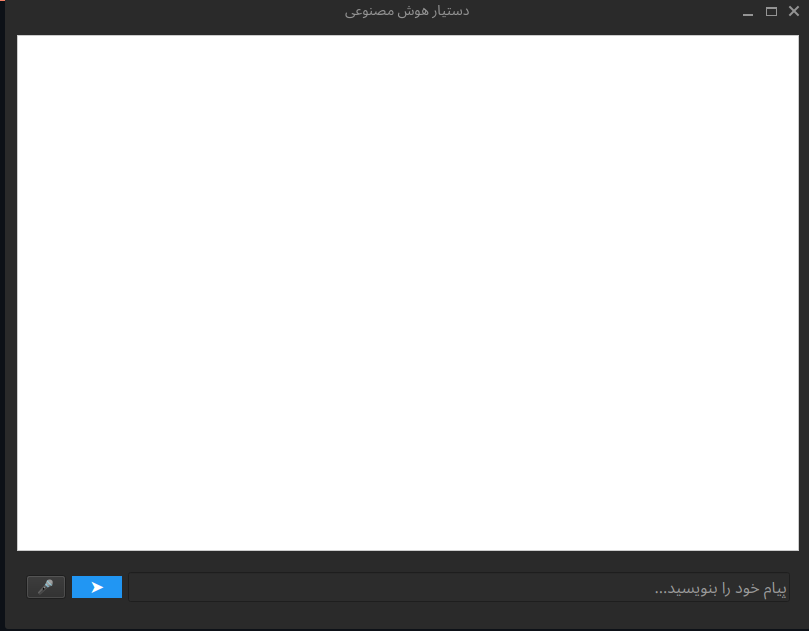
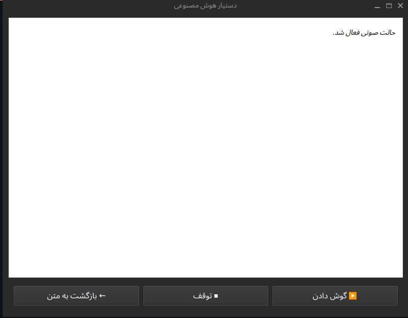

<!DOCTYPE html>
<html lang="fa">
<head>
  <meta charset="UTF-8">
  <title>🤖 دستیار هوش مصنوعی – Python + Ollama + Local Tools</title>
</head>
<body style="font-family:Tahoma, sans-serif; line-height:1.8; direction:rtl; background-color:#fff; color:#222; padding:20px;">

  <h1 style="color:#444;">🤖 دستیار هوش مصنوعی – Python + Ollama + Local Tools</h1>
  
این پروژه یک <strong>دستیار هوش مصنوعی پیشرفته</strong> است که به‌صورت کاملاً محلی (Local) اجرا می‌شود و می‌تواند متن، صوت، دستور، جستجو و ابزارهای مختلف را مدیریت کند. این برنامه با مدل‌های آفلاین Ollama و ابزارهای قابل‌توسعه کار می‌کند.

  

  <h2 style="color:#444;">🧠 معرفی پروژه</h2>
  <ul>
    <li>ارتباط از طریق رابط گرافیکی <strong>PyQt6</strong></li>
    <li>تحلیل پیام‌ها و تشخیص پاسخ یا اجرای ابزار</li>
    <li>اجرای ابزارها در محیط <strong>ایمن و ایزوله</strong></li>
    <li>استفاده از مدل‌های محلی <strong>Ollama</strong></li>
    <li>ساخت ابزار جدید با یک <strong>Prompt</strong></li>
    <li>جلوگیری از اجرای کدهای خطرناک</li>
    <li>معماری <strong>ماژولار</strong> و توسعه‌پذیر</li>
  </ul>

  

  <h2 style="color:#444;">⭐ ویژگی‌های اصلی</h2>
  <ul>
    <li>پشتیبانی از مدل‌های آفلاین Ollama</li>
    <li>تشخیص خودکار اجرای ابزار</li>
    <li>سیستم Trigger هوشمند</li>
    <li>ورودی صوتی → تبدیل گفتار به متن</li>
    <li>خروجی صوتی TTS</li>
    <li>جستجو داخل PDF و وب</li>
    <li>اجرای دستورات در محیط امن</li>
    <li>افزودن ابزارهای جدید</li>
    <li>پشتیبانی از فارسی و انگلیسی</li>
  </ul>

  

  <h2 style="color:#444;">🖼️ اسکرین‌شات‌ها</h2>
  

    
    
  

  

  <h2 style="color:#444;">⚙️ پیش‌نیازها</h2>

  <h3 style="color:#444;">1️⃣ نصب Ollama</h3>
  <h4 style="color:#444;">✅ ویندوز</h4>
  
دانلود از: <a href="https://ollama.com/download">https://ollama.com/download</a>

  <h4 style="color:#444;">✅ لینوکس</h4>
  <pre style="background:#f4f4f4; padding:10px; border-radius:5px;">curl -fsSL https://ollama.com/install.sh | sh</pre>

  <h3 style="color:#444;">2️⃣ نصب مدل‌ها</h3>
  <pre style="background:#f4f4f4; padding:10px; border-radius:5px;">
ollama pull dolphin3:latest
ollama pull phi4-mini:3.8b
ollama pull qwen2.5:7b
  </pre>

  <h3 style="color:#444;">3️⃣ نصب پکیج‌ها</h3>
  <pre style="background:#f4f4f4; padding:10px; border-radius:5px;">
python -m venv venv
venv\Scripts\activate  # ویندوز
source venv/bin/activate  # لینوکس / مک
pip install -r requirements.txt
  </pre>

  

  <h2 style="color:#444;">🚀 اجرای برنامه</h2>
  <pre style="background:#f4f4f4; padding:10px; border-radius:5px;">python main.py</pre>

  

  <h2 style="color:#444;">🔧 ساخت ابزار جدید (Tools)</h2>
  
ساختار پوشه:

  <pre style="background:#f4f4f4; padding:10px; border-radius:5px;">
project/
└── tools/
    └── your_tool/
        └── main.py
  </pre>
  
ورودی JSON از stdin و خروجی فقط JSON چاپی باشد.

  
تعریف ابزارها در فایل <code>tools.json</code> انجام می‌شود.

  

  <h2 style="color:#444;">📝 پرامپت ساخت ابزار</h2>
  
فایل <code>create_Tools.txt</code> شامل پرامپت کامل برای ساخت ابزار است.

  

  <h2 style="color:#444;">🗝️ نحوه فعال‌سازی ابزارها</h2>
  <pre style="background:#f4f4f4; padding:10px; border-radius:5px;">
TOOL_KEYWORDS=اجرا کن,بساز,جستجو کن,...
VERB_ROOTS=جستجو,سرچ,بگرد,...
  </pre>

  

  <h2 style="color:#444;">🧑‍💻 معرفی برنامه‌نویس</h2>
  

    
    

      <h3 style="margin:0;">👨‍💻 برنامه‌نویس پروژه</h3>
      
<strong>نام:</strong> سید حمیدرضا حسینی

      
<strong>ایمیل:</strong> hamidrezahosayni22@gmail.com

      
<strong>وبسایت:</strong> no-website

      
<strong>گیت‌هاب:</strong> <a href="https://github.com/HamidRezaHosayni">github.com/HamidRezaHosayni</a>

    

  

</body>
</html>
